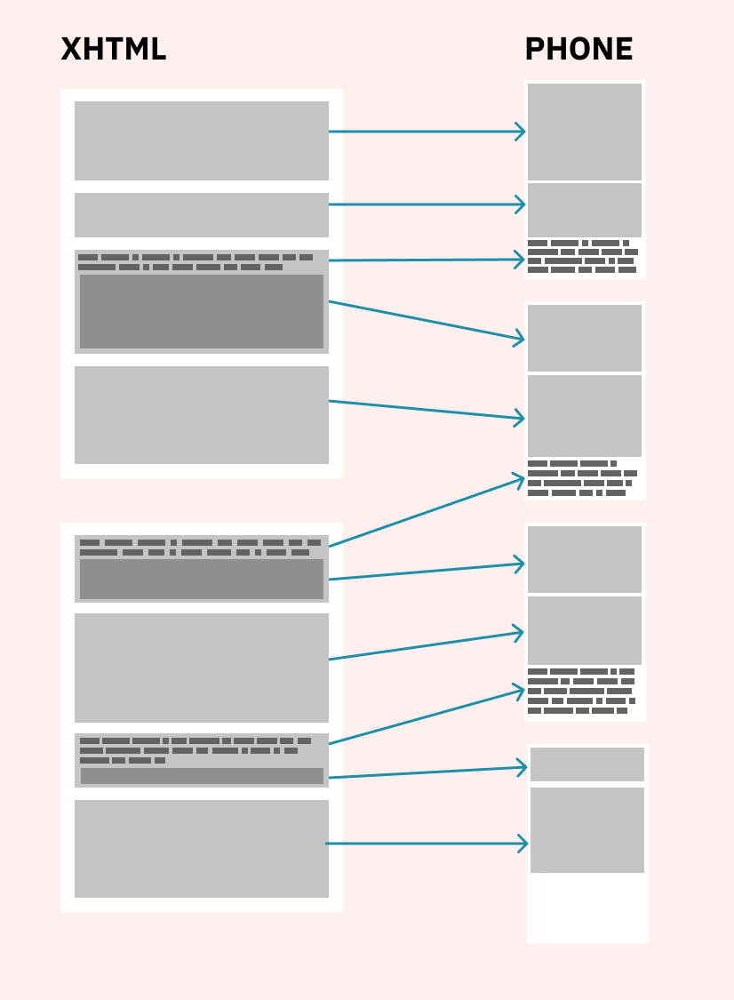

# ÖppenBók

ePub viewer for Android based OS

* Goals: a casual ePub reader with a solid UX, opens a book, remembers where you're up to - nothing else.
* Non Goals: everything else, no highlighting, in-app dictionary, annotation etc.

I want a good reading experience for one book at a time, to pick up where I left off, that's it.

## Status

Development has just begun, this is not fit for use yet.

### ToDo:

* Storage Access Framework .ePub import - *DONE*
* Unzip the imported file and cache locally - *DONE*
* Find index file and extract xhtml file array - *DONE*
* Process each file: break down into screen sized pages - *DONE*
* Store pages locally (in Room DB?) - *DONE*
* purge cache directory - *DONE*
* build UI (the fun bit) - *DONE*
* Bonus: Inline images - **TODO**

### Parsing

ePub files are just a series of xHtml files with CSS, this makes parsing books into mobile screen friendly chunks very tricky. This project takes each page, splits it into paragraph strings then adds them in turn until the height is greater than the available window height. The paragraph that overflows is then broken up into words which are added one by one to fill up the gap at the bottom. Any remaining words are then joined to a new line which is inserted at the start of the array and passed to process the next screen.

[View ChapterSplicerImpl.kt](https://codeberg.org/oppenlab/OppenBok/src/branch/trunk/app/src/main/java/oppen/oppenbok/io/splicer/ChapterSplicerImpl.kt)

### Reference

* [wikipedia.org/wiki/EPUB](https://en.wikipedia.org/wiki/EPUB)

## Attribution

Book loading animation is by [Филипп Чуланов (Philip Chulanov) from LottieFiles](https://lottiefiles.com/PhilipChulanov)

## Licence

[European Union Public Licence v. 1.2](LICENSE)

The page turning animation code is in the `page_turn` package and is derived from PlayLikeCurl, a Java library from 2016 by Karan Kalsi which was released under the  MIT License:
[github.com/karankalsi/PlayLikeCurl](https://github.com/karankalsi/PlayLikeCurl)
